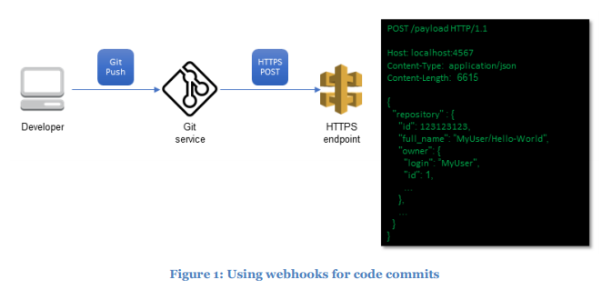
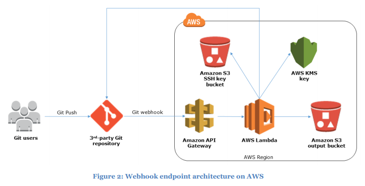

I found a quickstart resource that creates webhook endpoints and deploys an AWS lambda function to push my source code to S3. It uses a pre-existing Cloudformation template so lagi noob, just have to click Next... next... create...

<!--truncate-->

When the code is pushed to the git repo, the Git service sends a HTTPS POST to the endpoints. The POST contains JSON data about the push operation, and the repo details to fetch the latest version of the code. 

It then implements the code to trigger the Lambda function that zips up the code in the repo and plonks the .zip in S3. Ok lah, sounds simple enough (yet complicated at the same time) but try anyway. 

