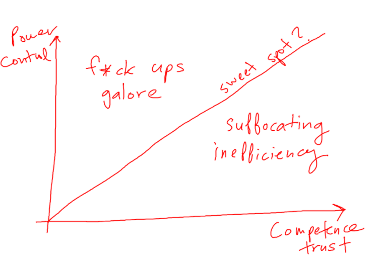
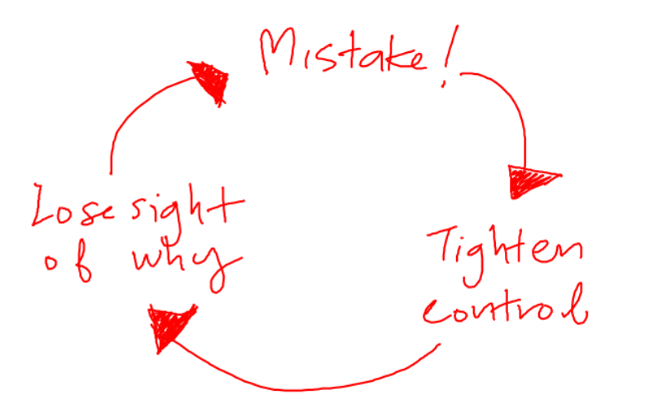

I've been thinking about this a lot lately. I've been wondering about whether empowerment is just a thing we like to say that we need, but never really get to see in action.

<!--truncate-->

If you've ever been any kind of leadership role, it's likely that at some point you've lamented about the lack of passion, creativity and self-starter attitude amongst your team members. Maybe you did one of 2 things:

1. Be prescriptive about what needs to get done, so that sh*t gets done
2. Give guidance, let them figure it out and leave them to get it done

Depending on just how much of a control freak they are, some bosses may never change their approach. But in my opinion, there is generally a preference for #1 for low competency-low trust teams and a preference for #2 for high competency-high trust teams.

Like so. 👆 There's this notion that if you give incompetent people too much control, then you're going to have a sh*tstorm on your hands. But if you take away control from super competent people, you stifle their innovation and they lose the will to live.

Most leaders didn't get to where they are by screwing up, so most tend to err on the side of caution and stay in the "suffocating inefficiency" under the line segment. This is a very comfortable and seductive place to be, despite its obvious productivity costs.

Firstly, it's great for the economy. Living in control town creates all sorts of jobs (thanks, [David Graeber](https://www.welcometothejungle.com/en/articles/bullshit-jobs-a-theory-by-david-graeber) and god rest your soul) like quality assurance, audit, inspection management and so on.

Secondly, you minimize the chance of f*ck ups. The preservation of a perfect record is a strong motivator for anyone with accountability over performance.

For the enlightened few who do operate courageously above the line, there's constantly pressure to drop back down below the line. Because of the vicious cycle that initiates once there is actually a f*ck up. Like so 👇

The knee jerk reaction to any mistake, is to tighten control. Decisions are moved further and further away from the people that are carrying out the work, to people in leadership positions. Leaders then become bottlenecks or spend inordinate amounts of their time trying to understand and control everything. Meanwhile, the people who are supposed to be doing actual work, are instead spending most of their time explaining and justifying their work.

Under the guise of creating transparency, come the processes and red tape. "Follow this to get approval!". What was once a meaningful job, is now reduced to following a rigid set of prescribed instructions. People lose sight of why they are doing what they are doing. When that happens, mistakes happen. And therein it begins to snow.

Empowerment can only truly arrive when people are given the room to fail. Companies like [Netflix taught us the ironic truth](https://netflix.github.io/chaosmonkey/): that the best way to learn from failure is to fail as frequently as possible. People become more competent at dealing with unexpected situations, they become more confident at trying different things, they're not confused about what their roles are when the sh*t hits the fan and they feel safe because their leaders have their backs.